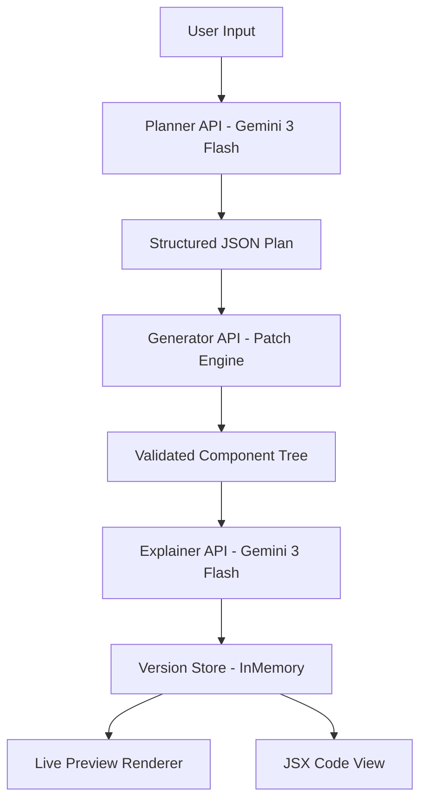

# 📘 Elemant – Deterministic AI UI Generator

Elemant is a deterministic AI-powered UI generator built with Next.js and Gemini.

It converts natural language UI intent into a structured component tree using a strict Planner → Generator → Explainer architecture.

## 🚀 [Live Demo](https://elemant.vercel.app)

## 🏗 Architecture Overview

Elemant follows a strict 3-layer architecture:



## 🧠 System Design

### 1. Determinism First
- The LLM never generates JSX or React components.
- It only generates structured JSON plans.
- Rendering is controlled by a deterministic engine.

### 2. Fixed Component Library
- The following components are strictly allowed and are pre-styled:
  - Page, Main, Section, Navbar, Sidebar, Card, Button, Input, Table, Modal, Chart
- The AI is restricted to using only these components. No new components can be created, and no arbitrary styles can be added.
- All components are deterministic and have predefined properties (props), ensuring consistent behavior across sessions.


### 3. Planner Layer (LLM)
- Route: /api/plan
Uses gemini-3-flash-preview

Receives:
    - User intent
    - Current UI tree (with IDs)

Returns:
```json
{
  "modificationType": "create" | "edit",
  "summary": "short description",
  "actions": [...]
}
```

### 4. Generator Layer (Deterministic)

Route: /api/generate
- Applies structured patch actions
- Uses fixed component registry
- Enforces schema validation
- Rejects unknown components
- Prevents full rewrites unless explicitly requested

Supported operations:
- addComponent
- removeComponent
- updateProp

### 5. Explainer Layer (LLM)
Route: /api/explain
- Receives previousTree + currentTree
- Generates human-readable reasoning
- Stored per version
- Triggered manually

## Setup Instructions
1. Clone
```bash
git clone <repo-url>
cd elemant
```
2. Install
```bash
npm install
```
3. Environment Variables

Create .env.local:
```ini
GEMINI_API_KEY=your_api_key_here
```
4. Run Locally
```bash
npm run dev
```

## 🗂 Versioning System

Stored in-memory:
```json
{
  versions: [
    {
      id,
      tree,
      explanation?,
      timestamp
    }
  ],
  currentVersionId
}
```
Features:
- Automatic version creation after generation
- Manual version creation after code edits
- Rollback support
- Explanation persistence

No database used.

## 🛡 Validation & Safety

Every tree is validated before rendering:
- Component whitelist enforcement
- Required prop enforcement & Unknown prop rejection
- Max depth limit
- Max children limit
- Literal-only prop values
- Basic unsafe string pattern blocking

Manual JSX edits are parsed using Babel AST, but:
- No code is executed
- Only allowed JSX structures are accepted
- Spread attributes are rejected
- Only literal values allowed in props

Rendering is fully controlled by the deterministic registry.

## 🔄 Incremental Editing

Elemant supports:
- Incremental patching
- Targeted component updates
- Prop updates
- Structural edits
- Rollback to previous state

Full regeneration is only allowed if explicitly requested.

## ⚡ Token & Model Strategy

Model: gemini-3-flash-preview

Reasoning:
- Lower latency
- Lower token cost
- Good structured JSON output
- Tree regeneration is avoided. Only patches are generated.

Separate planner and explainer calls reduce repeated generation

## 📦 Tech Stack

Frontend: Next.js (App Router)
AI: Gemini 3 Flash Preview
Rendering: Deterministic JSON Renderer
State: In-memory Version Store
Deployment: Vercel

## Tradeoffs & Constraints

### In-Memory Version Store
Pros:
- Simpler architecture
- No database setup
- Deterministic rollback

Cons:
- State resets on server restart

### Fixed Component Registry
Pros:
- Strong safety guarantees
- Predictable rendering
- Strict validation

Cons:
- Limited flexibility
- No arbitrary custom UI components

### Known Limitations
- **State resets** on server restart due to in-memory version storage.
- Limited flexibility with the **fixed component library**: Only predefined components can be used.
- No **persistent storage** for version history.
- The AI may not always handle **complex user inputs** as expected (e.g., highly intricate layouts).

## 🚀 Future Improvements
- Persistent database storage
- Real-time collaborative editing
- Token usage analytics

## 🎯 Key Design Principle

The LLM proposes structured intent.
The deterministic engine validates and decides what renders.

This separation guarantees safety, predictability, and incremental control.
